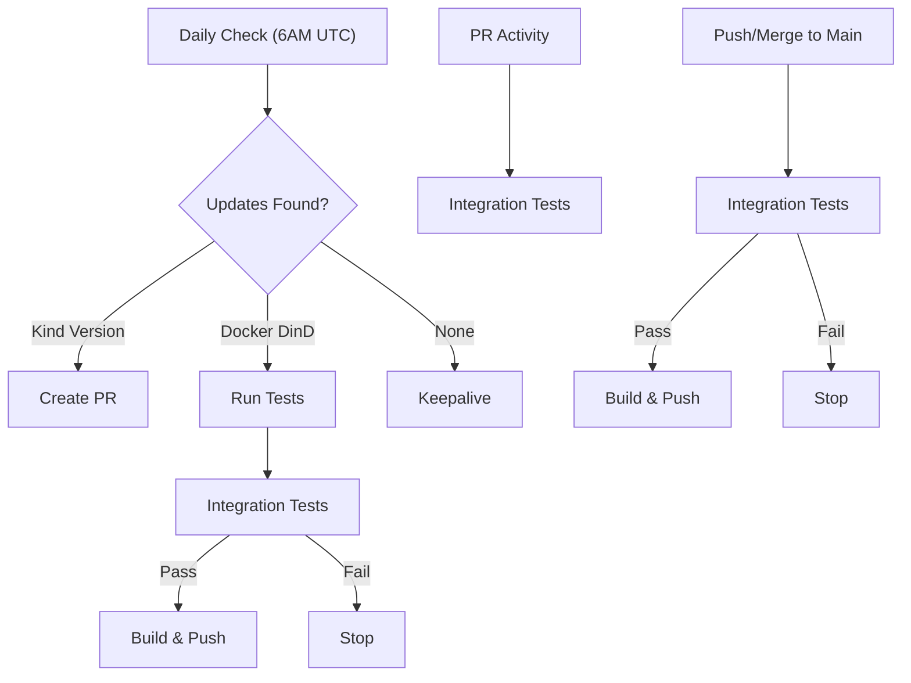

## Automated Updates
- **Daily**: Checks for Kind releases and Docker base image updates
- **Kind Updates**: Creates PR for manual review  
- **Docker Updates**: Automatically tests and rebuilds if base image is newer
- **Main Branch**: Push/merge to main triggers tests → build if tests pass
- **PR Testing**: Runs tests on pull requests without building images
