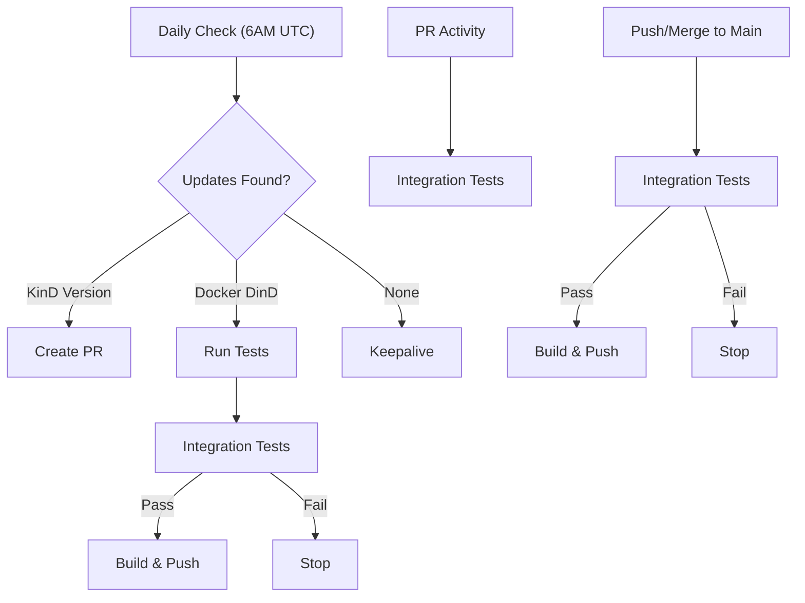

# KinDwRinD
[Kubernetes in Docker](https://kind.sigs.k8s.io/) with [Registry](https://docs.docker.com/registry/) in [Docker](https://hub.docker.com/_/docker) (KinDwRinD) is a project that provides a Dockerized environment for running an emphemeral Kubernetes cluster using KinD (Kubernetes in Docker).   The intent of this project is for CI/CD pipelines and quickly running Kubernetes locally. 

## Usage

#### Setup:

docker-compose
```yaml
services:
    kindwrind:
        image: binbashing/kindwrind
        container_name: kindwrind
        ports:
            - 6443:6443
            - 5000:5000
        volumes:
            - ~/.kube:/kubeconfig
        environment:
            - KUBERNETES_VERSION=v1.28.0  # Optional: specify Kubernetes version
```

docker cli
```bash
docker run -d \
    --privileged \
    --name kindwrind \
    -p 6443:6443 \
    -p 5000:5000 \
    -v ~/.kube:/kubeconfig \
    -e KUBERNETES_VERSION=v1.28.0 \
    binbashing/kindwrind
```

> **Note**: The `KUBERNETES_VERSION` environment variable is optional. If not specified, KinD will use its default Kubernetes version. Use format like `v1.28.0`, `v1.27.3`, etc.
#### Example usage:

```bash
# Start KinDwRinD
docker compose up -d

# Pull a public image
docker pull nginx:latest

## Tag image for local registry
docker tag nginx:latest localhost:5000/nginx:latest

## Push image to local registry
docker push localhost:5000/nginx:latest

## Create a Kubernetes deployment using the local registry image
kubectl create deployment hello-server --image=localhost:5000/nginx:latest 
```

## Automated Updates



- **Daily**: Checks for KinD releases and Docker base image updates
- **KinD Updates**: Creates PR for manual review  
- **Docker Updates**: Automatically tests and rebuilds if base image is newer
- **Main Branch**: Push/merge to main triggers tests → build if tests pass
- **PR Testing**: Runs tests on pull requests without building images

## License

This project is licensed under the [Apache License 2.0](LICENSE).
