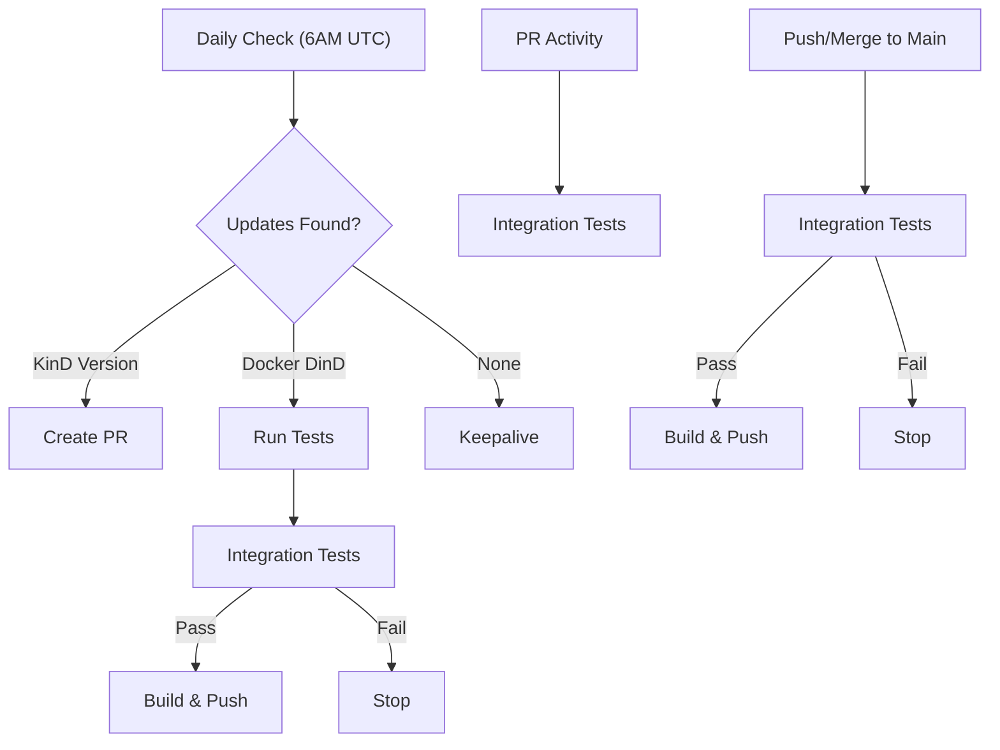

# KinDwRinD

**Kubernetes in Docker with Registry in Docker** - A complete Kubernetes development environment in a single container.

✅ **One command setup** - Get Kubernetes + Docker registry running instantly  
✅ **CI/CD ready** - Perfect for GitHub Actions, GitLab CI, Jenkins  
✅ **Local development** - Test Kubernetes deployments without complexity  
✅ **Isolated & clean** - Completely contained, no host pollution  
✅ **Multi-arch support** - Works on AMD64 and ARM64  
✅ **Built-in health checks** - Docker health check monitors readiness  
✅ **Always up-to-date** - Automated pipelines keep KinD and base images current

## Usage

#### Setup:

docker-compose
```yaml
services:
    kindwrind:
        image: binbashing/kindwrind
        privileged: true
        ports:
            - 6443:6443
            - 5000:5000
        volumes:
            - ${KUBECONFIG_DIR:-~/.kube}:/kubeconfig
```

docker cli
```bash
docker run -d \
    --privileged \
    --name kindwrind \
    -p 6443:6443 \
    -p 5000:5000 \
    -v ${KUBECONFIG:-~/.kube/config}:/kubeconfig/config \
    binbashing/kindwrind
```

> **Note**: You can specify a custom Kubernetes version using the `KUBERNETES_VERSION` environment variable (e.g., `KUBERNETES_VERSION=v1.33.0`). When set, KinD will create the cluster using `--image kindest/node:$KUBERNETES_VERSION`.

#### Example usage:

```bash
# Start KinDwRinD
docker compose up -d

# Pull a public image
docker pull nginx:latest

## Tag image for local registry
docker tag nginx:latest localhost:5000/nginx:latest

## Push image to local registry
docker push localhost:5000/nginx:latest

## Create a Kubernetes deployment using the local registry image
kubectl create deployment hello-server --image=localhost:5000/nginx:latest 
```

## Automated Updates



- **Daily**: Checks for KinD releases and Docker base image updates
- **KinD Updates**: Creates PR for manual review  
- **Docker Updates**: Automatically tests and rebuilds if base image is newer
- **Main Branch**: Push/merge to main triggers tests → build if tests pass
- **PR Testing**: Runs tests on pull requests without building images

## License

This project is licensed under the [Apache License 2.0](LICENSE).
